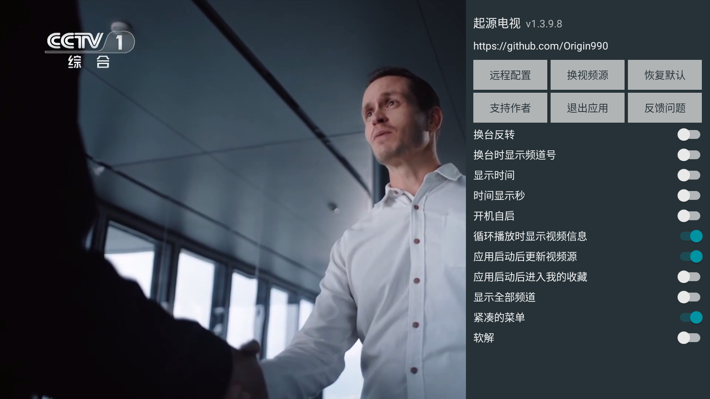
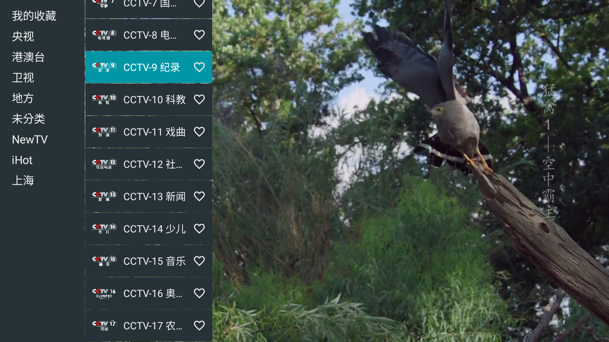
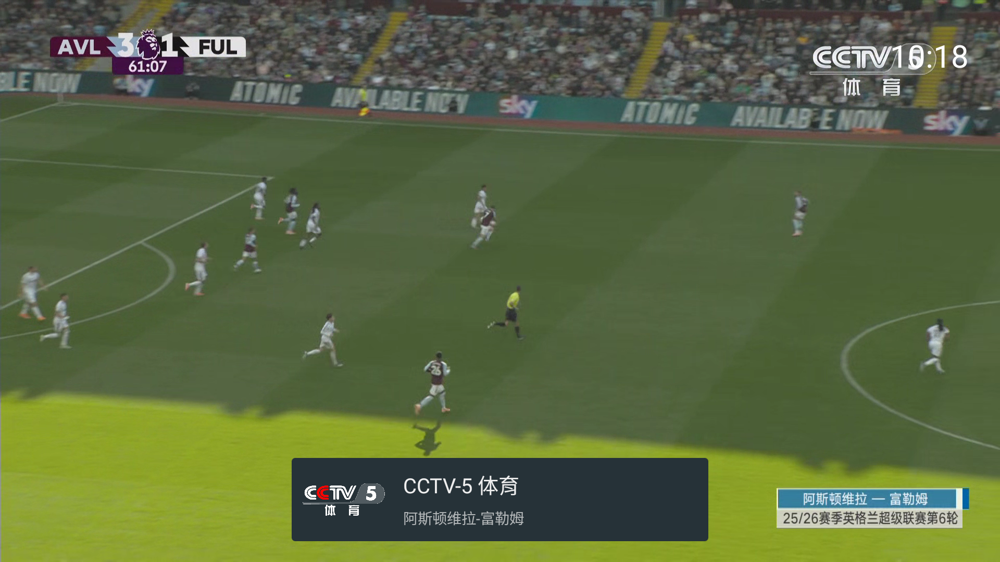

# 起源电视

Mr.zhen倾力打造的直播电视播控平台

原项目：
[my-tv-0](https://github.com/lizongying/my-tv-0)

## 使用

* 遥控器中键/触屏单击打开视频列表
* 遥控器右键/触屏双击打开配置
* 遥控器左键/触屏长按打开节目单
* 遥控器返回键关闭视频列表/配置
* 在聚焦视频标题的时候，右键收藏/取消收藏
* 打开配置后，选择远程配置，扫描二维码可以配置视频源等。也可以直接远程配置地址 http://0.0.0.0:34567
* 如果视频源地址已配置，并且打开了“应用启动后更新视频源”后，应用启动后会自动更新视频源
* 默认遥控器下键/触屏下滑切换到下一个视频。换台反转打开后，逻辑相反

注意：

* 遇到问题可以先考虑重启/恢复默认/清除数据/重新安装等方式自助解决
* 视频源可以设置为本地文件，格式如：file:///mnt/sdcard/tmp/channels.m3u
  /channels.m3u
* 为了使用方便，只支持设置3位频道号
* 目前设置代理后，需要重启生效。代理属于全局代理，也就是视频请求及其他请求都会使用代理。

目前支持的配置格式：

* txt
    ```
    组名,#genre#
    标题,视频地址
    ```
* m3u
    ```
    #EXTM3U x-tvg-url=""
    #EXTINF:-1 tvg-id="" tvg-chno="" tvg-name="标准标题" tvg-logo="图标" group-title="组名",标题
    #EXTVLCOPT:http-user-agent=
    #EXTVLCOPT:http-referrer=
    视频地址
    ```
* json
    ```json
    [
      {
        "group": "组名",
        "name": "标准标题",
        "title": "标题",
        "logo": "图标",
        "number": "频道号",
        "uris": [
          "视频地址"
        ],
        "headers": {
          "user-agent": ""
        }
      }
    ]
    ```

推荐配合使用原项目的 [my-tv-server](https://github.com/lizongying/my-tv-server)

下载安装 [releases](https://github.com/Origin990/ytf/releases/tag/ytf)

我们提供安卓4.4兼容版本。





## 其他

建议通过ADB进行安装：

```shell
adb install Android-5.0+.apk
```

小米电视可以使用小米电视助手进行安装。

由于小米出于安全原因，搭载TV HyperOS 2.0的电视机型不再支持APP安装功能，请使用adb方式安装。

## 常见问题

* 为什么远程配置视频源文本后，再次打开应用后又恢复到原来的配置？

  如果“应用启动后更新视频源”开启后，且存在视频源地址，则会自动更新，可能会覆盖已保存的视频源文本。

* 为什么我在安装时提示解析包时出现问题？

  我们在上传软件时已分为两种安卓版本，出现此问题的原因是您在Android4.4设备安装时使用了只兼容安卓5.0以上的安装包。

* 直播无法播放？

  软件是否可以正常播放直播取决于直播源，本人并不负责直播源的维护。

## 服务的变更或中止

发生下列情形之一时，开发者有权终止或中断本项目全部服务：

1. 因本项目及服务自身的需要；

2. 因突发性的软硬件设备与电子通信设备故障；

3. 因网络提供商线路或其他故障；

4. 当地政府原因或其他不可抗力的情形。

停止服务后，除特殊原因外，后续可能不再重新提供服务。

Mr.zhen 为你解锁 全新可能
